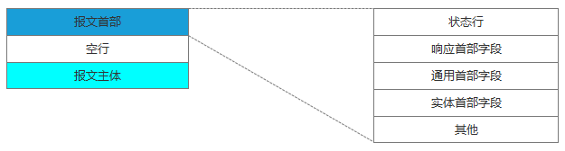
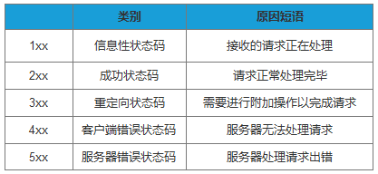

# 高频面试知识点
[高频面试算法题](https://blog.csdn.net/weixin_38118016/article/details/90761111)   
[高频面试知识点总结，看看你能答对多少](https://www.cnblogs.com/javazhiyin/p/11555823.html)  
[晓晓](https://blog.csdn.net/yuabcxiao/article/details/108324630)

## 目录
> * [深拷贝和浅拷贝](#1.深拷贝和浅拷贝) 
> * [2.内存对齐](#2.内存对齐)
## 1.深拷贝和浅拷贝

1.在未定义显示拷贝构造函数的情况下，系统会调用默认的拷贝函数??即浅拷贝，它能够完成成员的一一复制。
当数据成员中没有指针时，浅拷贝是可行的；但当数据成员中有指针时，如果采用简单的浅拷贝，则两类中的两
个指针将指向同一个地址，当对象快结束时，会调用两次析构函数，而导致指针悬挂现象，所以，此时，必须采
用深拷贝。  
2、深拷贝和浅拷贝的区别就是深拷贝会在堆内存中申请额外的空间来存储数据，从而也就解决了指针悬挂的问题。
简而言之，当数据成员有指针是，必须使用深拷贝。 浅拷贝的例子：

## 2.内存对齐

问该结构体输出所占内存大小。  
[变量大小、结构体大小](sizeof.cpp)  
考点：结构体数据对齐。

```
typedef struct _A{
   char a;
   int b;
   float c;
   double d;
   int *pa;
   char* pc;
   short e;
 }A;
 int main(int argc, char *argv[])
 {
   printf("size = %d\n",sizeof(A));
   system("pause");
   return 0;
 }
```

算法步骤：默认情况先按数据对齐，之后按整体对齐。  
数据对齐：按变量类型长度对齐

```
a=1->a%1=0;->a=1 补0  按长度1对齐

b=4->(a+b)%4=1; ->a+3+b=8  补3 按长度4对齐

c=4->(a+3+b+c)%4=0；->a+3+b+c=12 补0 按长度4对齐

d=8->(a+3+b+c+d)%8=4；-> a+3+b+c+d+4=24 补4  按长度8对齐

pa=4->(a+3+b+c+d+4+pa)%4=0;-> a+3+b+c+d+4+pa=28 补0  按长度4对齐

pc=4->(a+3+b+c+d+4+pa+pc)%4=0;-> a+3+b+c+d+4+pa+pc=32 补0  按长度4对齐

e=2->(a+3+b+c+d+4+pa+pc+e)%2=0;-> a+3+b+c+d+4+pa+pc+e=34 补0  按长度2对齐
```

整体对齐：按结构体变量类型当中长度最大进行对齐。

```
a+3+b+c+d+4+pa+pc+e%8=2  ;->a+3+b+c+d+4+pa+pc+e+6=40 补6 按长度8对齐
```

使用`#pragma pack(n) `指定长度大小对齐。n值必须为1,2,4,8…

## 3.左值和右值

C++ 中的左值（Lvalues）和右值（Rvalues）。 C++ 中有两种类型的表达式：  
**左值（lvalue）**：指向内存位置的表达式被称为左值（lvalue）表达式。左值可以出现在赋值号的左边或右边。  
**右值（rvalue）**：术语右值（rvalue）指的是存储在内存中某些地址的数值。右值是不能对其进行赋值的表达式，
也就是说，右值可以出现在赋值号的右边，但不能出现在赋值号的左边。

## 4.输入一个url后的过程；浏览器从发送请求的全部过程

DNS域名解析  
发起TCP的3次握手  
建立TCP连接后发起http请求  
服务器响应http请求 浏览器解析html代码，并请求html代码中的资源(如js,css,图片等)  
断开TCP连接 浏览器对页面进行渲染呈现给用户

## 5.DNS域名解析的递归查询和迭代查询

浏览器客户端向本地DNS服务器发送一个含有域名www.cnblogs.com 的DNS查询报文。本地DNS服务器把查询报文转发到根DNS服务器，根DNS服务器注意到其com后缀，于是向本地DNS服务器返回comDNS服务器的IP地址。本地DNS服务器再次向comDNS服务器发送查询请求，comDNS服务器注意到其www.cnblogs.com 后缀并用负责该域名的权威DNS服务器的IP地址作为回应。最后，本地DNS服务器将含有www.cnblogs.com 的IP地址的响应报文发送给客户端。


从客户端到本地服务器属于递归查询，而DNS服务器之间的交互属于迭代查询。
正常情况下，本地DNS服务器的缓存中已有comDNS服务器的地址，因此请求根域名服务器这一步不是必需的。
####5.数据特别大的时候，快速排序用递归会有什么问题？怎么解决？

会出现栈溢出（递归次数太多，大于栈的最大空间），可以使用堆排序，自己new空间。

## 6.http状态码

在HTTP里，有请求就会有响应，哪怕是错误信息。这里我们同样看下响应报文的组成结构：



在响应结果中都会有个一个HTTP状态码，比如我们熟知的200、301、404、500等。通过这个状态码我们可以知道服务器端的处理是否正常，并能了解具体的错误。
状态码由3位数字和原因短语组成。根据首位数字，状态码可以分为五类：


## 7.进程间的通信方式
管道（pipe）、信号、套接字socket、共享内存、信号量、消息队列
## 8.线程间的通信方式
临界区：
互斥量：
信号量：
事件（信号）:
## 9.select, poll和epoll时间的区别
网络通信模型
[链接](https://www.cnblogs.com/aspirant/p/9166944.html)

## 10.代码段和数据段

## 11，MySQL索引

## 12.虚函数
定义一个函数为虚函数，不代表函数为不被实现的函数。

定义他为虚函数是为了允许用基类的指针来调用子类的这个函数。

定义一个函数为纯虚函数，才代表函数没有被实现。

定义纯虚函数是为了实现一个接口，起到一个规范的作用，规范继承这个类的程序员必须实现这个函数。
#### 13. [RPC和gRPC](https://zhuanlan.zhihu.com/p/144926134)

**gRPC原理简析**
gRPC是由谷歌提出并开发的RPC协议，gRPC提供了一套机制，使得应用程序之间可以进行通信。 降级开发者的使用门槛，屏蔽网络协议，调用对端的接口就像是调用本地的函数一样。而gRPC的核心组成部分则是protocol buffers和http2.0
**protocol buffers**
开发者可以使用 pb compiler 生成用于读写数据代码。
多语言支持特性，轻松支持技术栈不同的上下游。
Protocol buffers是一个灵活的、高效的、自动化的用于对结构化数据进行序列化的协议。各种类型所用的编码算法如下所示
。。。
**HTTP 2.0**
新的二进制格式。
流量控制。
多路复用（MultiPlexing），即连接共享，即每一个request都是是用作连接共享机制的。一个request对应一个id，这样一个连接上可以有多个request，每个连接的request可以随机的混杂在一起，接收方可以根据request的 id将request再归属到各自不同的服务端请求里面。
header压缩，通讯双方各自cache一份header fields表，既避免了重复header的传输，又减小了需要传输的大小，像cookie这类重复的数据来回传输很占用带宽。
双向数据流，服务端也能具备主动推送消息的能力

**gRPC**
优势
效率高于 restful 服务，编码节约空间，使得在低带宽场景下很有优势。
pb compiler生成数据读写代码，提高开发者编码效率。
支持向上游传递超时时间，让上游在发现超时时主动决定如何执行后续操作，http1.1则会直接断开连接。
缺点
只有少数浏览器支持gRPC。
移动端网络可能在wifi及4G频繁切换，无法体现出长连接以及多路复用的优势。
编码后数据可读性低，json则具有很高的可读性。
小结
gRPC其实就是使用protocol buffer作为序列化协议（编码解码），http2.0作为通讯协议的RPC协议