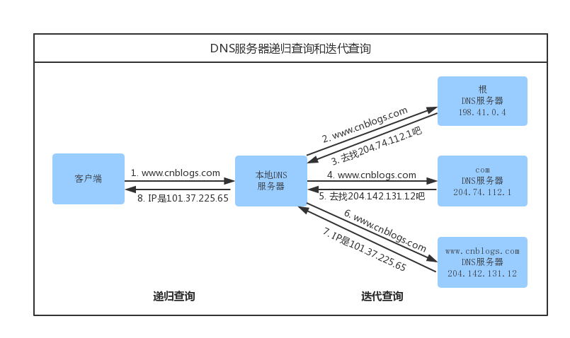

# 高频面试知识点

## 目录

#### 1.深拷贝和浅拷贝

1.在未定义显示拷贝构造函数的情况下，系统会调用默认的拷贝函数??即浅拷贝，它能够完成成员的一一复制。
当数据成员中没有指针时，浅拷贝是可行的；但当数据成员中有指针时，如果采用简单的浅拷贝，则两类中的两
个指针将指向同一个地址，当对象快结束时，会调用两次析构函数，而导致指针悬挂现象，所以，此时，必须采
用深拷贝。  
2、深拷贝和浅拷贝的区别就是深拷贝会在堆内存中申请额外的空间来存储数据，从而也就解决了指针悬挂的问题。
简而言之，当数据成员有指针是，必须使用深拷贝。 浅拷贝的例子：

#### 2.内存对齐

问该结构体输出所占内存大小。  
[变量大小、结构体大小](sizeof.cpp)  
考点：结构体数据对齐。

```
typedef struct _A{
   char a;
   int b;
   float c;
   double d;
   int *pa;
   char* pc;
   short e;
 }A;
 int main(int argc, char *argv[])
 {
   printf("size = %d\n",sizeof(A));
   system("pause");
   return 0;
 }
```

算法步骤：默认情况先按数据对齐，之后按整体对齐。  
数据对齐：按变量类型长度对齐

```
a=1->a%1=0;->a=1 补0  按长度1对齐

b=4->(a+b)%4=1; ->a+3+b=8  补3 按长度4对齐 

c=4->(a+3+b+c)%4=0；->a+3+b+c=12 补0 按长度4对齐

d=8->(a+3+b+c+d)%8=4；-> a+3+b+c+d+4=24 补4  按长度8对齐

pa=4->(a+3+b+c+d+4+pa)%4=0;-> a+3+b+c+d+4+pa=28 补0  按长度4对齐

pc=4->(a+3+b+c+d+4+pa+pc)%4=0;-> a+3+b+c+d+4+pa+pc=32 补0  按长度4对齐

e=2->(a+3+b+c+d+4+pa+pc+e)%2=0;-> a+3+b+c+d+4+pa+pc+e=34 补0  按长度2对齐
```

整体对齐：按结构体变量类型当中长度最大进行对齐。

```
a+3+b+c+d+4+pa+pc+e%8=2  ;->a+3+b+c+d+4+pa+pc+e+6=40 补6 按长度8对齐
```

使用`#pragma pack(n) `指定长度大小对齐。n值必须为1,2,4,8…

#### 3.左值和右值

C++ 中的左值（Lvalues）和右值（Rvalues）。 C++ 中有两种类型的表达式：  
**左值（lvalue）**：指向内存位置的表达式被称为左值（lvalue）表达式。左值可以出现在赋值号的左边或右边。  
**右值（rvalue）**：术语右值（rvalue）指的是存储在内存中某些地址的数值。右值是不能对其进行赋值的表达式，
也就是说，右值可以出现在赋值号的右边，但不能出现在赋值号的左边。

#### 4.输入一个url后的过程；浏览器从发送请求的全部过程

DNS域名解析  
发起TCP的3次握手  
建立TCP连接后发起http请求  
服务器响应http请求 浏览器解析html代码，并请求html代码中的资源(如js,css,图片等)  
断开TCP连接 浏览器对页面进行渲染呈现给用户

#### DNS域名解析的递归查询和迭代查询

浏览器客户端向本地DNS服务器发送一个含有域名www.cnblogs.com的DNS查询报文。
本地DNS服务器把查询报文转发到根DNS服务器，根DNS服务器注意到其com后缀，
于是向本地DNS服务器返回comDNS服务器的IP地址。本地DNS服务器再次向comDNS服务
器发送查询请求，comDNS服务器注意到其www.cnblogs.com后缀并用负责该域名的权威
DNS服务器的IP地址作为回应。最后，本地DNS服务器将含有www.cnblogs.com的IP地址
的响应报文发送给客户端。


从客户端到本地服务器属于递归查询，而DNS服务器之间的交互属于迭代查询。
正常情况下，本地DNS服务器的缓存中已有comDNS服务器的地址，因此请求根域名服务器这一步不是必需的。
####5.数据特别大的时候，快速排序用递归会有什么问题？怎么解决？
会出现栈溢出（递归次数太多，大于栈的最大空间），可以使用堆排序，自己new空间。

